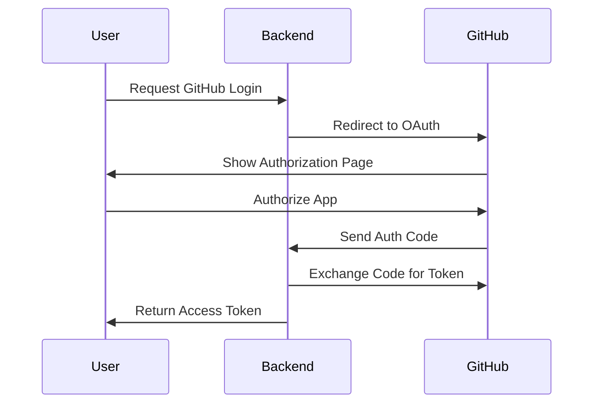
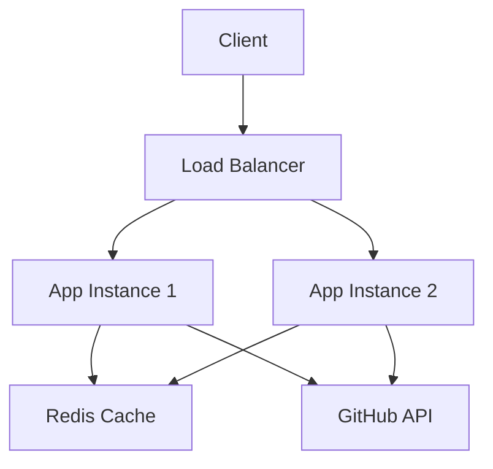

# Architecture Overview

This document provides a detailed overview of the GitHub Collaboration Backend's architecture, design patterns, and component interactions.

## System Architecture

The application follows a modern, modular architecture based on FastAPI framework with the following key components:

```
gitcollab-backend/
├── app/
│   ├── api/
│   │   └── v1/
│   │       └── endpoints/
│   │           ├── auth.py      # Authentication endpoints
│   │           └── github.py    # GitHub integration endpoints
│   │   ├── core/
│   │   │   ├── config.py           # Configuration management
│   │   │   └── exceptions.py       # Custom exceptions
│   │   ├── github/
│   │   │   └── client.py           # GitHub API client
│   │   └── schemas/
│   │       ├── auth.py             # Authentication schemas
│   │       └── github.py           # GitHub data schemas
│   ├── logs/                       # Application logs
│   ├── main.py                     # Application entry point
│   └── requirements.txt            # Project dependencies
```

## Component Details

### 1. API Layer (`app/api/`)

The API layer handles HTTP requests and responses using FastAPI:

- **Endpoints**: Organized by feature in `v1/endpoints/`
- **Version Control**: API versioning through URL prefixes
- **Response Models**: Pydantic models ensure type safety
- **OpenAPI**: Automatic API documentation generation

### 2. Core (`app/core/`)

Core components provide fundamental functionality:

- **Configuration**: Environment-based settings management
- **Exception Handling**: Custom exceptions and error responses
- **Middleware**: CORS, authentication, and logging
- **Security**: JWT token handling and validation

### 3. GitHub Integration (`app/github/`)

Handles all GitHub API interactions:

- **API Client**: Wrapper around GitHub's REST API
- **Rate Limiting**: Automatic handling of API limits
- **Error Handling**: Robust error management
- **Retry Logic**: Automatic retries for failed requests

### 4. Schemas (`app/schemas/`)

Data validation and serialization:

- **Request Models**: Validate incoming data
- **Response Models**: Structure API responses
- **Type Safety**: Pydantic models ensure type correctness
- **Documentation**: Auto-generated API specs

## Authentication Flow



## Data Flow

1. **Request Processing**:
   ```
   HTTP Request → FastAPI Router → Endpoint Handler → Business Logic → Response
   ```

2. **GitHub Operations**:
   ```
   Endpoint → GitHub Client → Rate Limiter → GitHub API → Response Processing
   ```

## Security Measures

1. **Authentication**:
   - OAuth 2.0 with GitHub
   - JWT token-based session management
   - Secure token storage

2. **Authorization**:
   - Role-based access control
   - Scope-based permissions
   - Resource-level authorization

3. **Data Protection**:
   - HTTPS enforcement
   - Environment variable security
   - Sensitive data encryption

## Error Handling

1. **Exception Hierarchy**:
   ```python
   BaseException
   └── GitHubAPIError
       ├── RateLimitError
       ├── AuthenticationError
       └── ResourceNotFoundError
   ```

2. **Error Responses**:
   - Consistent error format
   - Detailed error messages
   - Appropriate HTTP status codes

## Logging System

- **Levels**: DEBUG, INFO, WARNING, ERROR, CRITICAL
- **Format**: Timestamp, Level, Module, Message
- **Storage**: Rotating file logs
- **Monitoring**: Error aggregation and alerts

## Performance Considerations

1. **Caching**:
   - In-memory caching for frequent requests
   - Response caching where appropriate
   - Cache invalidation strategies

2. **Optimization**:
   - Async operations for I/O-bound tasks
   - Connection pooling
   - Resource cleanup

## Deployment Architecture



## Future Considerations

1. **Scalability**:
   - Horizontal scaling capabilities
   - Database integration if needed
   - Microservices architecture potential

2. **Monitoring**:
   - Performance metrics
   - Error tracking
   - Usage analytics

3. **Integration**:
   - Additional GitHub features
   - Other version control platforms
   - CI/CD system integration 